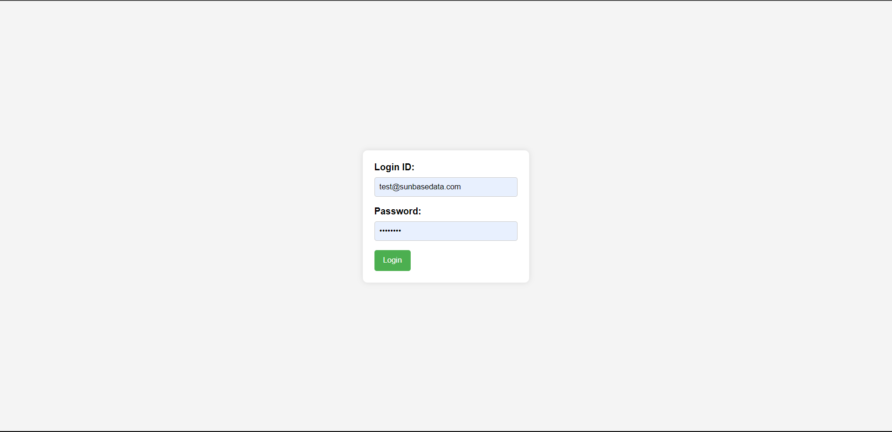
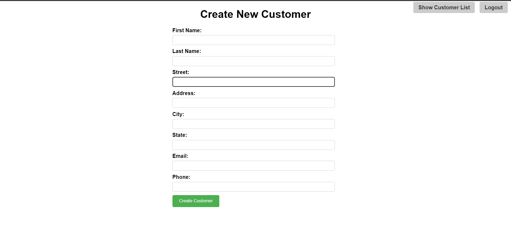
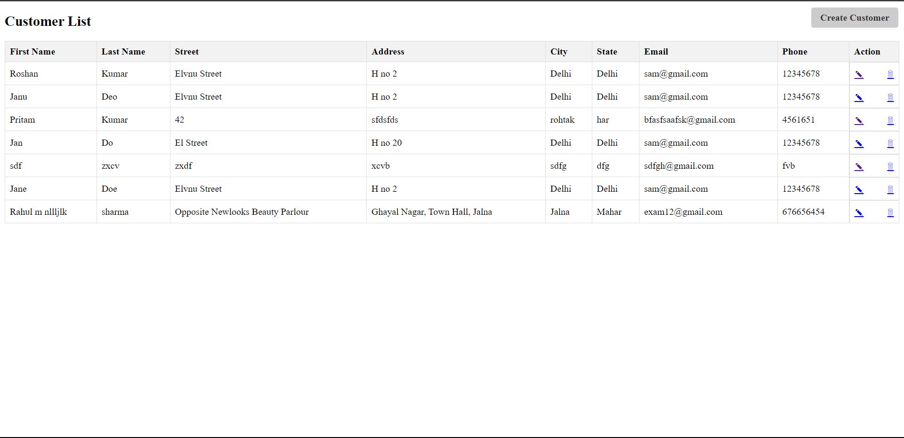
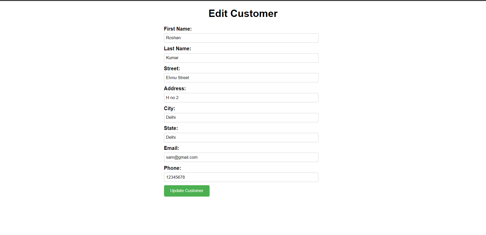

# Running a React Project from GitHub Locally
This guide provides steps to set up and run a Dynamic Web Project Using Tomcat from GitHub on your local machine.

# Prerequisites
* Java Development Kit (JDK),Integrated Development Environment (IDE) and Apache Tomcat installed on your system.
* Git installed to clone the repository.

# Steps:
1. Clone the Repository:  
Open your terminal or command prompt and clone the GitHub repository using `git clone <repository_url>`  
2. Navigate to the Project:  
Change your current directory to the cloned project folder using `cd <project_folder_name>`  
3. Open in IDE:  
 Import the project into your preferred Java IDE (Eclipse, IntelliJ IDEA, etc.).  
4. Run Using Tomcat:  
Configure Apache Tomcat in your IDE and deploy the project on the Tomcat server.

# Screenshots

  
  
  
  

